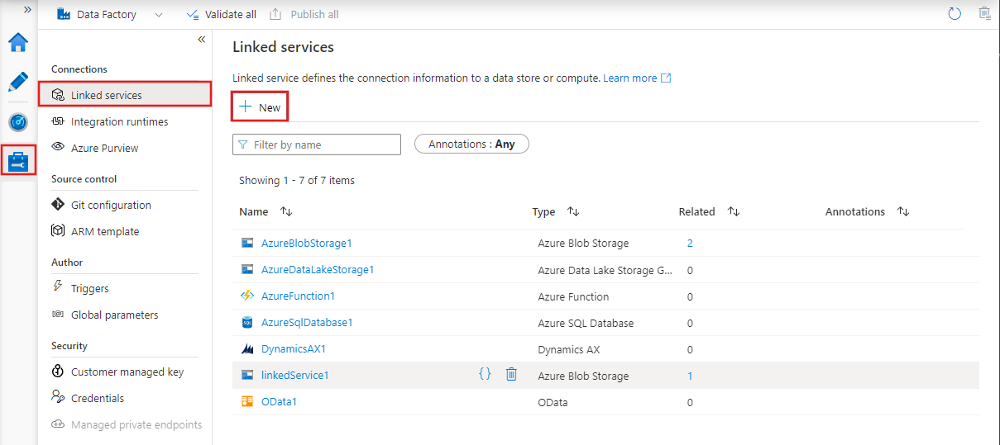

#adf #azure #redundancia

# Criando processos de Redundância de Arquivos no Azure

Vamos mapear a movimentação de dados de um banco de dados SQL on-premises para o **Azure Data Lake Storage**, organizando-os em camadas como _bronze_, _prata_ e _ouro_. 

---

### Visão Geral:

1. **Fonte de Dados**: Banco de dados SQL on-premises.
2. **Destino**: Azure Data Lake Storage (camadas: _bronze_, _prata_, _ouro_).
3. **Ferramenta de Orquestração**: Azure Data Factory.
4. **Conectividade**: Integration Runtime auto-hospedado para acesso ao ambiente local.
   
---

### Etapas de Implementação

### 1. Criar uma Conta de Armazenamento no Azure

- Acesse o [Portal do Azure](https://portal.azure.com).

- Crie uma nova **Storage Account**.
   
- Dentro da conta de armazenamento, crie os containers:
    
    - `log`
        
    - `bronze`
        
    - `prata`
        
    - `ouro`
        

### 2. Configurar o Azure Data Factory

- No portal do Azure, crie um novo recurso do **Azure Data Factory**.

- Após a criação, acesse o **Azure Data Factory Studio**.
   

### 3. Criar o Integration Runtime Auto-Hospedado

Para acessar dados on-premises, é necessário configurar um **Integration Runtime (IR)** auto-hospedado.

- No ADF Studio, vá para a aba **Gerenciar**.

- Selecione **Runtimes de Integração** e clique em **+ Novo**.
   
- Escolha **Auto-Hospedado** e siga as instruções para instalação no servidor local.

🔗 [Guia Oficial: Criar e Configurar um Integration Runtime Auto-Hospedado](https://learn.microsoft.com/pt-br/azure/data-factory/create-self-hosted-integration-runtime)

### 4. Criar Linked Services

**a) Fonte (SQL Server On-Premises)**

- Vá para a aba **Gerenciar** > **Linked Services** > **+ Novo**.

- Selecione **SQL Server**.
   
- Configure a conexão utilizando o IR auto-hospedado criado anteriormente.
   

**b) Destino (Azure Data Lake Storage)**

- Ainda em **Linked Services**, clique em **+ Novo**.
   
- Selecione **Azure Data Lake Storage Gen2**.
   
- Insira as credenciais e informações da conta de armazenamento criada.

🔗 [Guia Oficial: Criar Linked Services](https://learn.microsoft.com/pt-br/azure/data-factory/concepts-linked-services)

### 5. Criar Datasets

**a) Dataset de Entrada (SQL Server)**

- Vá para a aba **Autor** > **Datasets** > **+ Novo Dataset**.

- Escolha **SQL Server** como tipo de dados.

- Associe ao Linked Service do SQL Server criado anteriormente.

- Selecione a tabela de origem desejada.

**b) Dataset de Saída (Azure Data Lake Storage)**

- Crie um novo dataset selecionando **Azure Data Lake Storage Gen2**.

- Associe ao Linked Service do Data Lake.

- Defina o caminho do arquivo como `bronze/nome_do_arquivo.txt`.

🔗 [Guia Oficial: Criar Datasets](https://learn.microsoft.com/pt-br/azure/data-factory/concepts-datasets-linked-services)

### 6. Criar o Pipeline de Cópia de Dados

- Vá para a aba **Autor** > **Pipelines** > **+ Novo Pipeline**.

- Nomeie o pipeline como `CopiaSQLparaBronze`.

- No painel de atividades, arraste a atividade **Copy Data** para o canvas.

- Configure:

    - **Fonte**: Dataset de entrada (SQL Server).

    - **Destino**: Dataset de saída (Data Lake - bronze).

- Salve e publique o pipeline.

🔗 [Guia Oficial: Atividade de Cópia](https://learn.microsoft.com/pt-br/azure/data-factory/copy-activity-overview)

### 7. Executar e Monitorar o Pipeline

- Após a publicação, clique em **Trigger** > **Trigger Agora** para executar manualmente.

- Vá para a aba **Monitorar** para acompanhar a execução e verificar logs.

---

### Estrutura de Camadas no Data Lake

Organize os dados no Azure Data Lake Storage em camadas para melhor governança e processamento:

- **Bronze**: Dados brutos copiados diretamente da fonte.

- **Prata**: Dados limpos e transformados.

- **Ouro**: Dados prontos para consumo analítico e relatórios.

Essa estrutura facilita a manutenção, auditoria e escalabilidade do pipeline de dados.

---

